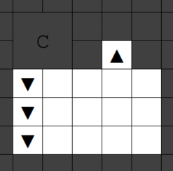
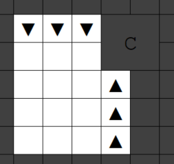
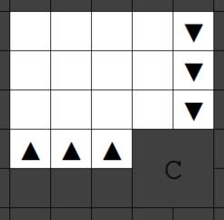
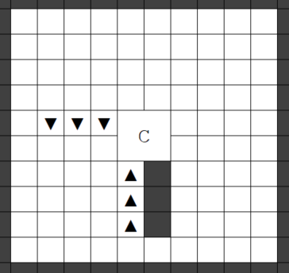

First Tasks and Standing Orders
-------------------------------

The first thing is to designate your wagon for removal, so you can use
its logs. This is a task for your carpenter, so don't go distracting
them with any tree-felling jobs or anything. Next, turn off your miners'
hauling labours (they need to focus!) and enable Brewing for your Herbalist/Woodcrafter.

- ⇨ Designate the wagon for removal (using `q`)
- ⇨ Turn off Miners' [hauling labors](http://dwarffortresswiki.org/index.php/DF2014:Labor 'wikilink')
- ⇨ Turn on [Brewing labor](http://dwarffortresswiki.org/index.php/Labor "wikilink") for your Herbalist/Woodcrafter

Additionally, let's change some [Standing orders](http://dwarffortresswiki.org/index.php/Standing_orders "wikilink").  It's best of only the farmers are allowed to `h`arvest, so they level up faster.  No `m`ix food, for easier tracking of supplies. Dwarves should gather refuse from outside, including vermin remains.  This creates a little extra work, but keeping refuse tidied away reduces the
[Undead](http://dwarffortresswiki.org/index.php/Undead "wikilink") risk. Going back out with `Esc` and then into the `F`orbid section, dwarves should claim used ammunition (`p`) and other death i`t`ems. We want useful items and corpses squared away, and will ensure that the surface is not accessible during mometns of danger anyway.  Finally, the `W`orkshop orders.  No auto `l`oom, no auto-collect `w`ebs. We want some thread left un-loomed for sutures, and collecting webs from the caverns is too dangerous. It will become feasible to change these options back later.

- ⇨ Set Orders (`o` from the main menu)
    - ⇨ `h`: Only Farmers Harvest
    - ⇨ `m`: No Mix
    - ⇨ `r`: Refuse
        - ⇨ `o`: Dwarves Gather Refuse From Outside
        - ⇨ `v`: Gather Vermin Remains
        - ⇨ `esc` back to the Standing Orders menu
    - ⇨ `F`: Forbid (capital 'f', lower case toggles Food gathering)
        - ⇨ `p`: Claim used ammunition
        - ⇨ `t`: Claim other death 
        - ⇨ `esc` back to the Standing Orders menu
    - ⇨ `W`: Workshop Orders (capital 'w', lower case toggles wood gathering)
        - ⇨ `l`: no Auto Loom
        - ⇨ `w`: no Auto Collect Webs
        - `esc` twice back to the main menu

Finding The Entrance
--------------------

Still not ready to unpause, sorry.

When your wagon gets deconstructed your supplies will just be left
strewn about, which is not very satisfactory, not least because food
rots when it's not in a food stockpile. The miners will take a while to
dig underground storage, so for now you'll stockpile everything outside
the entrance. Of course, that means we now need to plan the entrance.

It makes sense to put the fortress entrance in the middle of the map,
because then a) you're equidistant to all the resources the map has to
offer, and b) your entrance is maximally distant from every map edge,
where threats originate. Dig an entrance close to the map edge and a
were-moose might be knocking down your door before you can say “Oh,
shit…”

How to find the middle? The default size for an embark map is 192 tiles
on a side. So, starting with the most north west (i.e. top right) tile
as tile number 1, count diagonally towards the centre of the map (to the
south-east) until you reach the 96th tile. In the bottom-right corner of
that tile, where it meets the vertices of three other tiles, is the
middle of the map's latitude/longitude coordinates; that is, the centre
of the x (east-west) and y (north-south) axes. We're going to call it
the xy-origin, and it's in the corner between four tiles because the
maps are squares with even-numbered side lengths: if the sides were an
odd number of tiles, the xy-origin would be a single tile. There's an
xy-origin on every [Z-level](http://dwarffortresswiki.org/index.php/Z-level "wikilink"), at the corner where
these four tiles meet, so it forms a vertical axis running up through
the middle of each layer, and we'll plan the fort around that. In
addition, since the surface layer is z-level zero, the xy-origin on the
surface is also the xyz-origin (you could also call it the global origin
or **map centroid**), which is a single point (exists only on a single
layer) and not a line.

As a note, your map centroid may be a completely
inappropriate place to dig the entrance, on account of being in the
middle of a river, halfway into a cliffside, etc. In that case, just
find the nearest flat area with enough space (read ahead to see how much
you need). You could also consider some light terraforming re. digging
away or building up certain areas with e.g. constructed wooden floors),
but don't do too much.

Once you've found the four tiles which surround the map centroid, we can
dig the entrance. To make it a bit easier, you can mark 
the center by designating a ground-order (down-stair or channel), but 
using the "Marker Only (`m`)" option (meaning, you don't actually want your dwarves
to dig, you just want to mark).  Beginning at the south-east tile of the centroid,
start the mark.  Then, move left and up (covering 4 tiles now, then go down several
z-levels and click `enter` to complete the designation. You can use either Down Stair
or Channel, but Down Stair is recommended for clarity. 

Once you have marked the centroid, you will have a column
of  marked tiles that show your centroid.  Make sure to 
go back to "Standard" mode by pressing `m` again before you try to do 
actual digging. 

- ⇨ Find the centroid, `d`:designate, `m`:Marker Only
    - ⇨ `j`: Down stair (or `h`: channel if you prefer)
    - ⇨ Start at the south-east tile of the centroid, hit `enter`
    - ⇨ Move `left` then `up`, then `>` 20 or so times to go down, then `enter` again.
    - ⇨ `m`: return to Standard mode
    - `esc` to return to the main menu

Beginning at the south-east tile of the centroid
(represented as a `C` in the following diagram), count two more tiles to
the east, and designate a channel on that tile (`_`), like so (the '<' are the
marked down-stairs of the centroid):

```
{{diagram|spaces=yes|\
......
.>>...   
.>C._,   
......
}}
```


- ⇨ Designate a `h`:Channel two tiles east of the south-east corner of the centroid

As a side note, it's fairly simple to adapt this fortress design to
tunnelling straight into the side of a slope, but read ahead first to
make sure you understand the principles.

For now, that single channel tile defines what is inside and what is
outside your fortress (Even as the fortress matures, it will make like
an iceberg and be &gt;90% below the surface). A narrow entrance causes a
little congestion, but is easier to seal up, which is our current
priority. Making a completely secure entrance will come later, because
it requires mechanics and other things we might not have time for. For
now, we just need to get underground and batten down the hatches as best
we can.

You need to get inside!

Initial Zones and Stockpiles
----------------------------

We unpause in the next section, promise!

Now we have some coordinates by which to orient ourselves, we need to
designate a few [Stockpiles](http://dwarffortresswiki.org/index.php/Stockpile "wikilink") and [Activity
zones](http://dwarffortresswiki.org/index.php/Activity_zone "wikilink") nearby.

First, find the flowing water tile nearest the map centroid (as
instructed earlier, you should have embarked with a river or brook) and,
on the single bank tile *adjacent* to the water tile, designate a [water source](http://dwarffortresswiki.org/index.php/Activity_zone#Water_source "wikilink"). Until you 
install a well, this is the only clean water you have available.

- ⇨ Create a single-tile `Water Source` zone **adjacent** to the stream or river.

There are a couple more zones to create here on the surface. Your
[Grazers](http://dwarffortresswiki.org/index.php/Grazer "wikilink") 
will need a pasture zone so they don't
starve without [Grass](http://dwarffortresswiki.org/index.php/Grass "wikilink"). Create a
[Pasture](http://dwarffortresswiki.org/index.php/Pasture "wikilink") 
4x10 zone as shown in the following diagram,
and assign your sheep and wagon-hauling beasts of burden to this zone.
If your map doesn't have grass in the middle here, place the pasture
over the nearest grassy area.

```
{{diagram|spaces=yes|\
........
...====.
...====.
...====.
...====. Grazing
.>>====. Pasture
.>C====.
...====.
...====.
...====.
...====.
........
}}
```


- ⇨ Create a 4x10 `Pasture` zone east of the centroid.

Yes, it overlaps with the fortress entrance, but that won't be a problem
because pastures and creatures don't block movement. This size should be
plenty big enough to prevent over-grazing, which can be a concern. Your
animals will generally stay within its boundaries, though occasionally
will wander (or get spooked) and need to be dragged back. Later, we'll
move our livestock inside for safety.

There's one more activity zone to designate: a meeting area, where idle
dwarves and animals without pastures will tend to congregate. Obviously
we'd rather this was near the entrance, so they can quickly bolt to
safety if needed. The easiest thing to do is just add “Meeting area” to
the zone settings of your grazing pasture. Since we don't have many
animals and your dwarves won't be idle much, there should be enough room
to avoid over-crowding, which can cause animals to lash out.

- ⇨ Modify the `pasture` zone and add `Meeting area` to the zone.

Now it's time for a few [Stockpiles](http://dwarffortresswiki.org/index.php/Stockpile "wikilink"). Don't worry
if a few trees get in the way - the stockpiles should be large enough to
spare a few tiles, and we'll cut them down soon enough, at which point
you can re-designate the stockpiles.

First, you'll want a good-sized wood stockpile. In this diagram, the
wood stockpile overlaps with the map centroid, so remember where that
is:

```
{{diagram|spaces=yes|\
............
.wwwwww====. = pasture/meeting zone
.wwwwww====. w wood stockpile 
.wwwwww====. C SE corner of centroid
.wwwwww====.
.wwwwww====.
.wwwwwC====.
.......====.
.......====.
.......====.
.......====.
............
}}
```


- ⇨ Create a 6x6 `wood stockpile` over the centroid (and to the northwest).

<!-- TODO Is overlapping the centroid really necessary? Not sure it's worth confusion.-->

Next, we'll make a 6x4 corpse stockpile, placed like so:

```
{{diagram|spaces=yes|\
............
.wwwwww====. = pasture/meeting zone
.wwwwww====. w wood stockpile 
.wwwwww====. c corpse stockpile
.wwwwww====. 
.wwwwww====.
.wwwwww====.
.cccccc====.
.cccccc====.
.cccccc====.
.cccccc====.
............
}}
```


In addition, go into the corpse stockpile settings and enable the
[Refuse](http://dwarffortresswiki.org/index.php/Refuse "wikilink") category. However, only *some* refuse is
useless: turn off all refuse options, then turn on “Item Types”,
“Corpses” and “Body Parts”. Under “Item Times”, disable “Fresh Raw
Hide”, because this can be turned into leather and belongs near your
tannery.

- ⇨ Create a 6x4 `corpse stockpile` south of the wood stockpile
- ⇨ Modify the corpse stockpile and `e`:Enable `Refuse`, then `b`:Block All. 
    - ⇨ `p`:Permit `Corpses`,  `Body Parts`, and `Item Types`
    - ⇨ disable `Fresh Raw Hide` within the `Item Types`

Garbage management is important. Items in refuse stockpiles slowly decay
and disappear, which will keep useless body parts and enemy corpses from
hanging around forever. It needs to be on the surface, because dead
matter stored underground will [rot](http://dwarffortresswiki.org/index.php/Miasma "wikilink"), which makes
your dwarves unhappy. Finally, this stockpile will also serve as a
collection-point for the corpses of citizens in case we don't have any
coffins prepared for immediate burial, and for slaughtered animals if we
aren't able to butcher them all at once. Better to collect them
somewhere nearby. Later, we'll secure the refuse stockpile against the
threat of [Necromancers](http://dwarffortresswiki.org/index.php/Necromancer "wikilink").

Finally, we want a stockpile for all the supplies from our wagon. Create
a 10x10 food stockpile, and place it like so:

```
{{diagram|spaces=yes|\
......................
.wwwwww====ffffffffff. = pasture/meeting zone
.wwwwww====ffffffffff. w wood stockpile 
.wwwwww====ffffffffff. c corpse stockpile
.wwwwww====ffffffffff. f food stockpile
.wwwwww====ffffffffff.
.wwwwww====ffffffffff.
.cccccc====ffffffffff.
.cccccc====ffffffffff.
.cccccc====ffffffffff.
.cccccc====ffffffffff.
......................
}}
```


- ⇨ Create a 10x10 `food stockpile` to the east of the pasture.

Then go into the settings and enable “Furniture/Siege Ammo”, “Finished
Goods”, “Weapons/Trap Comps”, and “Cloth”. This will be plenty of room
for all the goods from your wagon, plus a few extra items we'll generate
before our underground storage is ready.

- ⇨ Modify the food stockpile to `e`:Enable `Furniture/Siege Ammo`, `Finished Goods`, 
 `Cloth`, and `Weapons/Trap Comps`


Striking the Earth
=============

<!-- pick up with the rest tomorrow. -->

Alright, time to actually tell your miners what you want the fortress to
look like. The design is quite complicated, but starts by digging down
nice and deep.

Generally, it's a good strategy to leave a large buffer zone of un-mined
layers between the surface and your fort, for several reasons. In the
layer immediately under the surface, tree roots penetrate the soil and
felled trees leave gaps which are security vulnerabilities. You can
patch them up but eventually the whole roof of soil will get replaced
with paving, and that means no more trees or plants for you to harvest.
Also, undermining murky pools and rivers results in annoying
announcements and designation cancellations. You can override these, but
if you get forgetful later on you risk accidentally puncturing the roof
and flooding your fortress. But the final, and most important reason, is
flexibility. If you want to dig a moat around your fortress entrance -
and we will - having a buffer of un-mined layers avoids extensive
fortress remodelling.

The cost, of course, is time. Right now, your miners are at their least
experienced, and progress through stone will be frustratingly slow. But
unless - for example - there's a [Giant lion](http://dwarffortresswiki.org/index.php/Giant_lion "wikilink")
bearing down on you *right now*, I think the benefits outweigh the
costs.

The layer below your entrance should look like this:

Now it's time to go down a layer and designate the next set of digging,
which should look like this:

```
{{diagram|spaces=yes|\
.........
..>>+-+..
..>C¦∆¦..
.¦∇    ¦.
.¦∇    ¦.
.¦∇    ¦.
.+-----+.
.........
}}
```



Note that the centroid is not excavated (it is just marked, and should be designated with
a different color than a normal mining designation). Also, you don't have to
explicitly designate the up-ramps: they will appear when the channel in
the z-level above is completed.

The next z-level down should look like this:


```
{{diagram|spaces=yes|\
.........
.+---+...
.¦∇∇∇¦>>.
.¦   ¦>C.
.¦   ∆¦..
.¦   ∆¦..
.¦   ∆¦..
.+----+..
.........
}}
```



And the next like this:

```
{{diagram|spaces=yes|\
.........
.+-----+.
.¦    ∇¦.
.¦    ∇¦.
.¦    ∇¦.
.¦∆∆∆¦>>.
.+---+>C.
.........
}}
```



Noticing a pattern? We're creating a spiral ramp around the xy-origin.
Continue the spiral down to z-level number -10 (i.e. 10 levels below the
surface) and you have hit stone (you should have hit stone by -10, but if
you haven't, keep digging). When viewing the z-level number, be aware that 
it's calculated relative to ground level wherever the view is currently 
centred, so it can change as you navigate around. If in doubt, count manually.

- ⇨ Continue `mining` and `channeling` the spiral ramp down until you get to 
a **depth of -10** *and* **you have hit stone**. 

This might seem like a lot more work than just digging a straight shaft
from up/down stairs, but it has advantages:

-   Trade wagons can get down the ramp into the safety of your fortress
-   Falling dwarves fall right *through* stairs, but not ramps
-   The spiral design ensures that there's no consecutive layers of
    mined tiles on top of one another, which means any accidental
    [Cave-ins](http://dwarffortresswiki.org/index.php/Cave-in "wikilink") won't punch a hole right down to the
    bottom of the shaft
-   Plenty of room for dwarves to move around one another

Again, a little extra digging now will save you time and remodelling in
the long run. A stitch in time, as they say.

Once you've reached z-level -10, the designation is somewhat different:

```
{{diagram|spaces=yes|\
..............
.+----------+.
.¦          ¦.
.¦          ¦.
.¦          ¦.
.¦          ¦.
.¦ ∇∇∇>>    ¦.
.¦    >C    ¦.
.¦    ∆█    ¦.
.¦    ∆█    ¦.
.¦    ∆█    ¦.
.¦          ¦.
.+----------+.
..............
}}
```



- ⇨ `Mine` an 11x11 room centered on your fortress center, but including the 
continuation of the ramp `channel` to continue the spiral further.
    - **Do not** mine out the supporting stone behind the up-ramps!
    - Do mine out the centroid (the markers will be replaced when you designate
    the area for mining).

Again, remember not to designate any mining actions on the up-ramp tiles
- they'll appear when [Channelled](http://dwarffortresswiki.org/index.php/Channel "wikilink") from above. In
addition, don't mine the three tiles directly behind the up-ramps, which
are needed for the [Ramps](http://dwarffortresswiki.org/index.php/Ramp "wikilink") to work. We are, however,
going to mine out the tiles around the centroid (the four xy-origin tiles).

