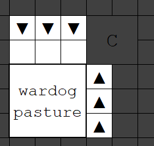

Getting to work
---------------

As promised, you can unpause now. As an important aside, it's crucial to
pause whenever you're ready to schedule more tasks, need to plan or
think about something, and just generally whenever there's something
you, as overseer, could be doing. As time in dwarf fortress marches on,
the probability of a nasty visitor approaches 1, so try to always have a
clear idea of your priorities and keep your dwarves busy. Often, it's
best to read a section or two ahead and try to do enough things
simultaneously that your dwarves aren't spending much time going idle.
Don't overload them, though - you should be regularly clearing the
backlog of hauling jobs and having dwarves going idle. Be aware that it
can be hard to tell the difference between truly idle dwarves and those
just trying to figure out what their next job is.

- ⇨ Unpause the game.
    - Be ready to pause whenever you need to schedule more tasks.

When you unpause, your carpenter will begin deconstructing the wagon,
and the others will begin dragging the appropriate animals to the
pasture. Once the wagon is turned back into wagon wood, all your items
will be strewn about. The miners will pick up their picks and start
digging, while everyone else will start hauling items to the “everything
stockpile” we designated to the right of the entrance. Your dogs, cat
and peahens will make their way to the meeting area/pasture all by
themselves. At the earliest opportunity, your woodcutter will pick up
their axe and then resume hauling.

#### Temporary Workshops

Once the wagon has been deconstructed, immediately use two of the wooden
logs to build a carpenter's workshop and a craftsdwarf's workshop
abutting the wood stockpile. 

Once the cart is deconstructed, make a `Carpenter's Workshop` from one
of the logs. We will also need a `Metalsmith's Forge` (temporarily using our 
anvil) and a `Wood Furnace` to eventually build our gate. It's not too imporant 
where these go, they can be on the surface or, if things are looking dicey, in 
the ramp-spiral. These are temporary, so it doesn't really matter where they go. 
By the time we get to ordering their construction, your miners should have some 
stone available to use.

- ⇨ Build a temporary `Carpenter's Workshop` next to the wood stockpile
- ⇨ Build a temporary `Craftdwarf's Workshop` next to the wood stockpile
- ⇨ Build a temporary `Metalsmith's Forge`
- ⇨ Build a temporary `Wood Furnace`

When your carpenter has made these, order
up a wooden hatch cover, and when it's finished, install it over the
single channel tile which is the entrance to your fortress.
Congratulations! You now have a lockable front door, though it won't
hold up to thieves or building destroyers.

- ⇨ Order a `wooden hatch cover` at teh carpenter's workshop.
- ⇨ Install the `woodent hatch cover` over the entrance to your fortress.

#### Guard Dogs

Your miners should dig out the first two layers (z-levels -1 and -2)
pretty quickly, since they are probably in soil. Once that is done,
create a pasture on level -2 and assign the war dogs to it like so:

```
{{diagram|spaces=yes|\
.........
.+---+...
.¦∇∇∇¦>>.
.¦   ¦>C.
.¦===∆¦.. war dog
.¦===∆¦.. pasture
.¦===∆¦..
.+----+..
.........
}}
```


- ⇨ Designate a 3x3 `Pasture` zone on level -2
- ⇨ Assign the `war dogs` to the pasture.

Your war dogs will hang around here to sniff out and see off any
sneaking thieves, and they won't block access for trade wagons, which
can (somehow) just roll right over the top.

If you have a particularly deep soil horizon or your wagon was
particularly far from the map centroid, your miners may finish their
work before everything is hauled to the surface stockpile. If so, skip
to the next section. If not, a little busy-work will give you a head
start:

- ⇨ Designate all trees within a radius of about 21 tiles of the
    entrance for felling
    - ⇨ queue up `wooden bins` on repeat at the `carpenter's workshop`
-   Queue up 10x `wooden pots` at the `craftsdwarf's workshop`, 
    - ⇨ when pots are complete, designate about 10 plants nearby for gathering (then
    repeat: pots then gathering)

However, don't get carried away, because your miners shouldn't take
*that* long, and the more you produce now the more you'll have to haul
inside. A few idle dwarves are nothing to fear at this stage. In
particular, don't designate massive areas because unfortunately dwarves
aren't smart enough prioritise work from the inside out, and gravitate
to the far corners. You can do this manually from the designation menu
but it's overkill at this stage. In particular, beware of designating
large quantities of plants for gathering. Your herbalist will continue
gathering until they're *severely* encumbered, which slows things down
rather a lot.

Getting inside
--------------

Soon enough, your miners should be finished with the large storage room
on level -10. Make a 10 x 10 stockpile here which accepts food,
furniture, finished goods, and cloth, and set it to “take” from the
rightmost stockpile on the surface (the large “everything” stockpile
which began as a food stockpile). We've excluded weapons from this
underground stockpile because your picks and axes are now all safely in
dwarven hands.

- ⇨ Create a stockpile in the 10x10 room set to accept: `food`, `furniture`,
`finished goods`, and `cloth`.
    - ⇨ Set the stockpile to "take" from the "everything stockpile" on the
    surface (the large one to the east)

In addition, overlay this 10 x 10 storage room with a 10 x 10 zone. Make
it a meeting zone and a [Temple](http://dwarffortresswiki.org/Temple "wikilink") dedicated to no
particular deity. In the surface zone which is a combination
pasture/meeting zone, remove the meeting zone option. Your idle animals
and dwarves will now hang out here, safely underground, and your dwarves
have somewhere to pray or meditate when they feel the urge.

- ⇨ Designate a 10x10 `Meeting Area` zone in the room, with a `l`ocation type of `Temple`.
    - ⇨  Deselect `Meeting` from the surface zone.

Cancel any tree-felling, carpentry or plant-gathering jobs and
designations until everything is inside, and even temporarily re-enable
hauling labours on your miners. Once everything is inside, disable
hauling on your miners once again, then remove the large rightmost
stockpile on the surface.

Congratulations, you made it - your dwarves and most of their
possessions are now behind a lockable door, and have begun digging out a
proper fortress.

Soil Farming
------------

Instructions on making a farm in the soil level.

- ⇨  Designate an 11x11 room right off of the **second** ramp section with an `Up/Down Stair` in the very center.
- ⇨ Right above that, designate a `Down Stair`
- ⇨ Surrounding the `Down Stair`, designate four 3x4 rooms, each diagonally connected to the Down Stair.
- ⇨ Follow the section 3 guide to setting up the farms and the 11x11 room with workshops and stockpiles. 

Made it!
--------

Of course, things might not have gone to plan. If something arrives at
your fort and either a) it won't go away, so you can't safely access the
surface or b) it's a [Building Destroyer](http://dwarffortresswiki.org/index.php/Building_Destroyer "wikilink")
and it's coming this way and *oh Armok it's breaking down the hatch…*
you'll have to engineer a more permanent solution. That's beyond the
scope of this guide because it constitutes a fairly substantial
deviation from The Plan, but the most general and powerful approach is
as follows.

First, protect yourself from building destroyers. First, make sure your
dwarves are all inside, then mine away the single up-ramp to the
surface, and replace it with a wall constructed of mining stone (you
should have some by now). Second, you need to engineer
[Cave-in](http://dwarffortresswiki.org/index.php/Cave-in "wikilink") traps, then lure the thing(s) into them
and activate them. There's [a lot of ways to do this](http://dwarffortresswiki.org/index.php/Trap_design#cave-in_trap "wikilink") but a word to the wise:
either make it so the traps and fortress access can be activated
remotely, from behind a walled-in fallback position, or *don't bloody
well miss*. Make more and bigger traps than you think you need,
especially if you might only get one shot. Once the dust has settled,
scrape the interloper off the geology and try to pick up where you left
off.

Worst case scenario, if you didn't heed my advice and find yourself in a
location where the surface is chronically unsafe, well, your best bet is
to try to make a home in the caverns and hope your seven dwarves really,
*really* like one another… but that's another section in this guide.
