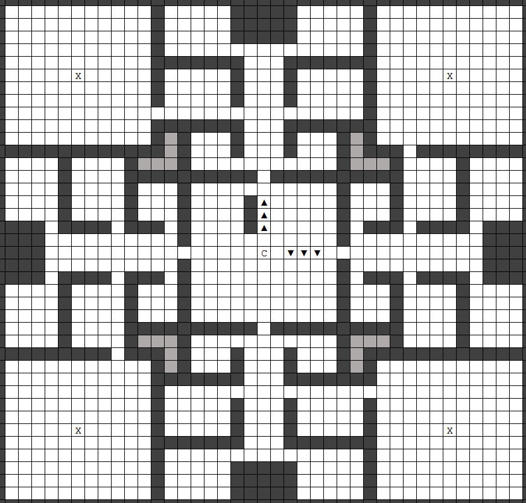
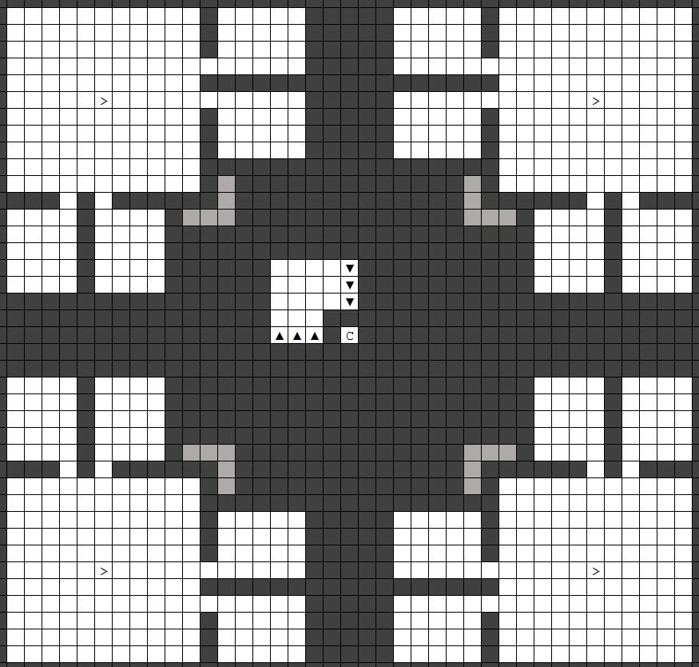

The Fortress Pattern
--------------------

Digging a bunch of rooms higgledy-piggledy can cause serious headaches
later on, and there are actually a lot of considerations when digging a
fortress. Allow me to explain:

-   Did you know that cave-ins will punch through floors if there's a
    space immediately below? That means that alternating excavated
    floors with solid rock is fairly sensible. Cave-ins suck.
    Unstoppable cave-ins suck a lot harder.
-   Did you also know that pathfinding is a lot more efficient when
    there's a small number of paths from A to B? That means that,
    although highly interconnected patterns might be efficient in terms
    of minimising detours, they slow your framerate a lot. A branching
    design with minimal loops and a lot of dead ends might make things a
    little slower for your dwarves, but they speed the game up
    considerably for the player. In any case, intelligent placement of
    infrastructure can help minimise hauling time for your dwarves.
-   Do you also know what your layout needs are going to be when you
    have fifty dwarves? A hundred? Two hundred, and a pile of
    freeloading booze-guzzlers in your taverns? Neither do I. That means
    a modular approach is desirable, which can be repeatedly adapted to
    multiple use-cases as your needs change, and also avoids the work of
    coming up with a new floorplan for every little section of the
    fortress.
-   Did you also know that, eventually, you will probably have good
    reasons for piping water, magma, and power to and from unpredictable
    locations in your fort? Leaving a lot of space for this kind of
    plumbing is also sensible.
-   And finally, if there's one resource any embark has in abundance,
    it's depth. A good fortress floorplan makes more use of the z-axis
    than any other.

Having considered all these attributes and tried a few zany layouts (did
you know hexagons are the most efficient of the self-tesselatory shapes,
in terms of space and edge/vertex connectivity?!), I've arrived at the
following blueprint. It's pretty efficient, secure, flexible, tileable
and shouldn't require extensive remodelling. It might seem complicated
at first (you should have seen the beehive fort), but I'll explain the
purpose of each feature and once you understand it, it's easier to work
with.

As you already know, it's based around a central spiral ramp, and the
storage room you've created is right at the centre. Here's what the rest
of it is doing:

-   In this main level, there are a few large, 11 x 11 rooms with
    smaller storage attached, which makes it easy to create “districts”
    devoted to a particular industries and 
    [organised processing chains](http://dwarffortresswiki.org/index.php/Workshop_design "wikilink").
-   The lighter-grey tiles in the gaps between rooms are actually
    plumbing ducts, so remember where they go but don't mine them out. 
    We'll soon divert some water from the river for farms, wells, 
    hospitals, and so forth.
-   The X in the middle of each large corner room indicates up/down
    stairs. Yes, this design extends to the level above and below, and
    yes, it's alright to use stairs as long as you don't stack a pile of
    them on top of one another.
-   There are a mixture of large, medium and small rooms which can be
    allocated in any way you please (bedrooms, stockpiles, workshops,
    public spaces etc.).
-   The corridors extending from the central room in the cardinal
    directions can be extended beyond the edges of the outermost rooms
    and then the design can be horizontally tiled, though for now you
    should focus on tiling it *vertically* since this is going to be
    more path-efficient (and doesn't create loops, which are absent from
    the singly-stacked configuration).
-   The corridors are nice and wide so your dwarves don't have to climb
    over one another (which slows them down) or frequently find their
    path blocked by another dwarf and try to re-route (which slows the
    game down).
-   It's also fairly secure, because each section can be quarantined by
    lockable doors (and eventually raising bridges).
-   Thanks to the generous gaps above and below, there's also provision
    for [Cleaning\#Dwarven
    Bathtubs](http://dwarffortresswiki.org/index.php/Cleaning#Dwarven_Bathtub "wikilink") - more on these
    later.

(Before you dive in, be aware that while your miners are doing this the
rest of your dwarves shouldn't be standing idle. I have jobs for them in
the next sections, so read ahead before unpausing…)

- ⇨ Read ahead through the rest of the Stone Industry section before unpausing.

<!-- there is no way that the miners will be done mining the stone *and* wood quarters before people need something to do. -->

The lowest-oversight way to proceed is to go ahead and designate that whole
pattern, but leave the connecting hallways un-designated so that you can focus your miners on working district by district.  We will be starting with the north-west quadrant: the stone disctrict. Once you are ready, unpause and let your miners get to work.  As the
miners dig, they'll unearth a few interesting gems and bits of ore, but
for now, just leave them where they fall. 

Due to some quirks of
[Miner\#Mining behaviour](http://dwarffortresswiki.org/index.php/Miner#Mining_behaviour "wikilink"),
you'll actually get individual rooms completed more quickly if you only
designate a few at a time.  You can get this behavior by either 1) designating small areas at a time, or 2)  that's the reason for keeping a line of hallway stone un-designated for the districts we aren't working on yet. If you want to get a jump-start on the stockpiles and workshops, have the miners do the 11x11 room first, then designate the upper,lower, and side rooms. Personally, I'd rather sit on a minotaur's horn than designate tiny areas so frequently, but maybe at least do one of the large corner rooms in this fashion.

- ⇨ Optionally undesignate doorways leading to the three doorways leading to the districts we aren't working on yet.
- ⇨ Unpause the Game 
- ⇨ Pause the game if the miners get done with the 11x11 main floor room  to work on building the stone district workshops.

While the miners are working on the middle floor of the district, you can start designating the upper and lower floors for this layer.  However, you may want to leave the :

- ⇨ Designate the pattern for the upper and lower floors of the layer. 
- ⇨ Let the miners continue working on the upper and lower floors after they have finished the first 11x11 room.

That's the upper level, immediately above the middle layer you just dug
out. The pattern won't quite be identical in the upper and lower layers:
in the corner rooms, obviously, on the upper level you'll designate
down-stairs, and on the lower level you'll designate up-stairs. Also
your spiral ramp may happen to be in a different orientation to mine -
it doesn't matter, as long as it lines up with the levels above and
below!

Once that three-level design has been dug out, simply tile it
vertically, with a gap between units. For example, if we denote G as a
gap layer (spiral ramp only), M as the middle layer where we began, and
U and L as the upper and lower floors we just talked about, then
vertically the pattern should go G-U-M-L-G-U-M-L-G… and so forth. Keep
your miners going in this manner until they hit the first layer of
caverns. Those constitute another part of this guide, but for nowmy
advice is *seal them off and never speak of them again*. They are very
dangerous! If you get to this stage you can keep your miners busy
chasing veins of ores and gems.

<!-- is there really time to chase ore and gems at this stage? -->

So, while your miners are digging away, what about the rest of your
frontiersdwarves? First, let's talk about securing that entrance. We're
going to need stone blocks for walls and a roof around the entrance, and
only raising [bridges](http://dwarffortresswiki.org/index.php/Bridge "wikilink") will stop building destroyers
in their tracks, for which we'll need mechanisms. In addition, dragons
can burn down stone bridges and mechanisms, so you'll use one of your
iron ingots for the bridge, and make the other into a fire-proof
mechanism. As long as you're quick enough with the drawbridge lever,
that'll keep out everything except ghosts. But there's a bit of a chain
of production that needs to happen to get all that in place.

This construction will make use of our temporary workshops that we built near the surface.