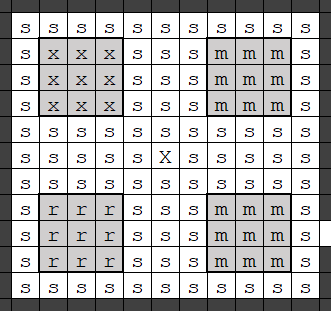

The Stone District
------------------

The first and easiest thing is the stone industry (but this is a long
section since we begin teaching stockpile mechanics). Your miners will soon 
be producing more stone than you can handle, so when one of the larger rooms 
in the mid-layer is finished, build a some relevant workshops and surround 
them with a stone stockpile. My preferred layout is as follows:



This is the Stone District Workshop Room (the north-west corner of the Middle floor that we just mined out). 

`s` = stone stockpile

`m` = mason's workshop (yes, two - there's a good reason to add extra
masons soon)

`b` = block stockpile
<!-- TODO: there isn't actually a block stockpile! -->

`x` = mechanic's workshop
<!-- TODO: use 't' for mechanic -->

`r` = craftsdwarf's workshop

<!-- TODO: why designate the stockpile first, it's much easier to put the workshops in, then designate the stockpile over everything? -->

Designate the 11 x 11 stone stockpile first, then make 3 x 3 cutouts for
the workshops. Exactly which workshop goes in which 3 x 3 space doesn't
particularly matter, but otherwise it's laid out this way for several
reasons. Placing the stone stockpile right next to the workshops which
use it saves the poor bastards from lugging it all over the map, which
can take forever - set the stockpile to “give” to these four workshops,
so they only use stone from the stockpile. Lugging stone to stockpiles
is faster, because you will now go into stockpile options and assign it
three wheelbarrows. Even so, your craftsdwarves will often use up the
stone faster than it can be hauled, so a large stone stockpile gives you
decent reserves.

- &#8680; Place 2x `Mason's Workshops` on the east side of the room.
- &#8680; Place a `Mechanic's Workshop` in the north-west corner of the room.
- &#8680; Place a `Craftsdwarf's Workshop` in the south-west corner of the room.
- &#8680; Designate the rest of the room to be a stone stockpile, set the stockpile to give to the workshops.
- &#8680; Assign 3x `wheelbarrows` to the stone stockpile

### A Subtle Appreciation of Stone

There's a few more changes you need to make (stockpile management is
complex). First, not all stones are appropriate for crafting in these
workshops. Have a look at all the different types of
[Stone](http://dwarffortresswiki.org/index.php/Stone "wikilink") your miners have encountered, and individually
look them up on the wiki. In addition, read [The Non-Dwarf's Guide to
Rock](The_Non-Dwarf's_Guide_to_Rock "wikilink"). In this stockpile, you
should only enable stones which are present on your map and which
*don't* fall into the following categories (here begins an educational
but brief detour into the subject of satisfying dwarven preferences):

#### Stone To Avoid for the Main Stockpile

 Type | Specific | Notes 
------|----------|------
[Ore](http://dwarffortresswiki.org/index.php/Ore "wikilink")| `gold`, `silver`, `hematite`, etc... | Later we will smelt these into metal bars.
[Economic stone](http://dwarffortresswiki.org/index.php/Economic_stone "wikilink") | [Flux Stone](http://dwarffortresswiki.org/index.php/Flux "wikilink"), [Fuel Sources](http://dwarffortresswiki.org/index.php/DF2014:Fuel "wikilink"), [Gypsum plaster sources](http://dwarffortresswiki.org/index.php/Gypsum_plaster "wikilink")  | These are important for industry, we shouldn't make chairs out of them.
 Heavy "Other Stone" | `cinnabar`,`pitchblende`, and `cobaltite` | Heavy and inefficient to haul. Later, we can use these as ammo in catapults and stone-fall traps.
 Rare Stone | All [Other Stone](http://dwarffortresswiki.org/index.php/Stone#Other_Stone "wikilink") that is [preferred](http://dwarffortresswiki.org/index.php/Preference "wikilink") by a dwarf | This stone is somewhat rare, appearing in pockets and veins instead of layers.
 Dark Red Stone | `bauxite` | Colour substitutes include `kaolinite` (but better to use that for porcelain), `hematite` (much more valuable smelted into iron!) and, for some items, `blood thorn wood` (only found in the deepest cavern layer)
 Red Stone | `petrified wood` and `realgar` | Colour substitutes include `cinnabar` (moderately abundant in veins but impractically dense for general use) and, for some items, `goblin-cap wood` (though only found in the very dangerous second and third levels of caverns)
 Green Stone| `olivine` (large clusters) and `serpentine` (clusters within olivine) | Since these are the same colour,best to use the more abundant `olivine` for satisfying colour preferences and save `serpentine` for the more specific material preferences. Colour substitutes include `malachite` (more valuable as an ore of copper) and `green glass` (particularly if you have sand on the map, and even more so when you get magma power)
 Dark Blue Stone| `kimberlite`  (veins) | Colour substitute for some items is nether-cap wood, but only available in the 3rd cavern layer
 Blue Stone| `cobaltite` (veins) | Too heavy for general use but literally the only straight-blue material in the game.
 Purple Stone| `pitchblende` and `rutile` | Pitchblende is too heavy for general use. Colour substitutes include `black bronze`, which is more valuable and not otherwise very useful, so actually better for satisfying colour preferences, and `glumprong wood` (only found in evil regions so, apart perhaps from trade, you shouldn't be going anywhere near the stuff)
The Lightest Stone | `jet` | Jet is the *lightest* stone in the game, so it's best saved for making lightweight stone pots which will be faster to haul about. 

If you're lucky enough to find `jet`, you can make a dedicated stockpile somewhere which gives to a dedicated craftsdwarves' workshop and only make your stone pots from this workshop. There's a speed benefit to using the jet as soon as you find it, but you may also wish to use heavier materials for now and save your jet for more skilled craftsdwarves which will be able to do the material justice. More mature fortresses with ordinary [Clay](http://dwarffortresswiki.org/index.php/Clay "wikilink") (not fire clay) on the map have an alternative, which is to make earthenware pots (essentially the same weight); these are more costly to produce, however, since you need a potter, a glazer, some glazing material, a pottery kiln, and one unit of fuel each for firing the clay and glazing the pot.

<!-- TODO: write recommendations for a jet workshop and stockpile.  Idea: Put the workshop in the Stone District lower floor pot stockpile room with a small Jet stockpile surrounding it. -->

Finally, after setting the stockpile options to allow *only* the stones
which are both present on your map and not reserved for any of the uses
described above, open the z-menu, go to “Stone” and disable all “Other
Stone” except the ones allowed in your stockpile.

<!-- TODO: You mean go to the 'z' Status screen, to Stone, to Other Stone, and mark all stone as restricted?  Or just disable the stone in the stockpile (q)? -->

- &#8680; Set the stone stockpile to allow *only* available stones that are not in any of the above categories.

This seems like an awful lot to think about and a lot of work, I know,
but trust me. For one thing, this is important education in game
mechanics - Dwarf Fortress is a game of *detail*, and although it’s a
lot to take in at once you're going to need to get this fine-grained
sooner or later. 

Secondly, we can better understand and control the
complex interplay of materials, stockpiles, workshops, products, and
individual dwarven quirks by making each area as specific as possible
and therefore as simple as possible. That means, as a general principle,
it's a lot more work to go through all the menus and individually
*disallow* things you aren't currently using; better to `Block all` as much
as possible and then individually *allow* things as they become
available/needed. Another reason this approach works well is because of
the sheer amount of z-space you have to play with in Dwarf Fortress.
When you come across a new resource or bring a new part of your industry
online, there's no reason not to set up a dedicated area.

### The Many Uses of Rocks

Alright, back to the diagram. The other stockpile is for blocks, which I
prefer to have close to the central spiral for faster deployment. They
get a smaller pile than stone because, although we need a lot, they can
be stacked fairly efficiently in bins. Again, go into the stockpile
settings and turn off everything except the blocks made of the stones
allowed in your stone stockpile.

<!-- NOTE: not sure where this block stockpile is -->

For the other products of these workshops, we'll use the floors above
and below. On each of those floors we'll have 1 x large space (A1 and B1) and 4 x
medium spaces (A2-4, B2-5) to work with (so ten total upper and lower rooms). 

On the Main floor, there are 4 medium rooms (M2-5), and two small rooms (M6,7).  But what should go where? There's a confusing diversity of products from the mason's and (in particular) the
craftsdwarf's workshops. Again, our principle should be to disallow
everything, and then allow only what we have and need right now (or in
the near future). Taking that into consideration, here is my recommended
allocation. 

In the layout diagram below, each room is labeled for use in the table below.  The stockpile "Type" column is “u”  for a `Furniture` stockpile, and “g” for a `Finished Goods` stockpile.

```
{{diagram|spaces=yes|\
     Lower           ¦              Middle             ¦       Upper
+-----------+-----+  ¦  +-----------+-----+   +-----+  ¦  +-----------+-----+
¦L1         ¦L2   ¦  ¦  ¦M1         ¦M2   ¦   ¦M3   ¦  ¦  ¦U1         ¦U2   ¦
¦           ¦     ¦  ¦  ¦ xxx   mmm ¦     ¦   ¦     ¦  ¦  ¦           ¦     ¦
¦           ¦     ¦  ¦  ¦ xxx   mmm ¦     +---+     ¦  ¦  ¦           ¦     ¦
¦                 ¦  ¦  ¦ xxx   mmm ¦               ¦  ¦  ¦                 ¦
¦           ¦-----+  ¦  ¦           +-----+   +-----+  ¦  ¦           ¦-----+
¦     >           ¦  ¦  ¦     X     ¦M4   ¦   ¦M5   ¦  ¦  ¦     <           ¦
¦           ¦     ¦  ¦  ¦           ¦     ¦   ¦     ¦  ¦  ¦           ¦     ¦
¦           ¦     ¦  ¦  ¦ rrr   mmm +     +   +     ¦  ¦  ¦           ¦     ¦
¦           ¦L3   ¦  ¦  ¦ rrr   mmm                 ¦  ¦  ¦           ¦U3   ¦
¦           ¦-----+  ¦  ¦ rrr   mmm +-+---+   +---+-+  ¦  ¦           ¦-----+
¦           ¦        ¦  ¦           ¦ ¦ M6¦   ¦M7 ¦    ¦  ¦           ¦ 
+--- + -----+        ¦  +-----------+ ¦   ¦   ¦   ¦    ¦  +--- + -----+ 
¦    ¦    ¦          ¦                ¦           ¦    ¦  ¦    ¦    ¦  
¦    ¦    ¦          ¦                +----+ +----+    ¦  ¦    ¦    ¦  
¦    ¦    ¦          ¦                                 ¦  ¦    ¦    ¦  
¦    ¦    ¦          ¦                                 ¦  ¦    ¦    ¦ 
¦L4  ¦L5  ¦          ¦                                 ¦  ¦U4  ¦U5  ¦ 
+----+----+          ¦                                 ¦  +----+----+ }}
```

Room | Type | Designation
---- | ---- | -----------
L1 | u | Large Pots: `large pots/food storage`
L2 | u | Less-used barriers: `floodgates`, `hatch covers`, `grates`
L3 | u | (semi-)Functional furniture: `traction benches`, `querns`, `millstones`, `armour stands`, `weapon racks`
L4 | u | Storage: `boxes and bags`, `cabinets`
L5 | u | Dining: `tables` & `thrones` (chairs) 
M1 | u | Main Stone Storage & Workshops
M2 | g | Mugs (goblets in the menu)
M3 | g | Tools, which includes nest boxes for now, and eventually bookshelves and hives
M4 | b | Block storage: `blocks and slabs`
M5 | u | Doors
M6 |   | Dormitory
M7 |   | Dormitory
U1 | u | Mechanisms: `mechanisms`
U2 | u | Decorations/memorials: `coffins`, `statues`, `slabs`
U3 | g | Toys
U4 | g | Musical Instruments
U5 | g | Crafts for trade goods (figurines, amulets, scepters, crowns, rings, earrings, bracelets)

<!-- TODO: cabinets and bins are separate from 'boxes and bags' -->

- &#8680; Build all of the Stone District stockpiles.
- &#8680; As you specify the stockpiles, disallow those items from your central stockpile in the ramp room.  

These stockpiles cover all the products of the mason's workshop, the
mechanic's workshop, and all the stone items you *should* be producing
from a craftsdwarf's workshop in the short-to-medium term. There's one
section of the “Finished goods” stockpile in particular which is a bit
of a grab-bag of various classes of objects: [Tools](http://dwarffortresswiki.org/index.php/Tools "wikilink").
For now, we deal with it by avoiding the manufacture of anything except
a nest box or two. Later, I discuss easy ways of managing this
heterogeneous category by ensuring that different tools are made from
different materials. Finally, in each of the finished goods and
furniture stockpiles, you should disallow all materials other than the
stone(s) permitted in your stone stockpile. Make sure you still allow
all quality levels (both core and total), though!

- &#8680; Disallow all materials other than permitted stone (but remember to allow all quality levels!)

Efficient placement of [workshops](http://dwarffortresswiki.org/index.php/Workshop "wikilink") and
[stockpiles](http://dwarffortresswiki.org/index.php/Stockpile "wikilink") is crucial because your list of jobs
will usually far exceed your available dwarf-power. Logical and
highly-specific compartmentalisation of industry process-chains is also
essential to understand and control what is being produced from what,
and where things are being stored. you should
[read](http://dwarffortresswiki.org/index.php/Workshop_design "wikilink") about
[this](http://dwarffortresswiki.org/index.php/Stockpile_design "wikilink").

Don't immediately queue up a bunch of jobs, because we'll need to wait
until the stone stockpile is fairly well-stocked if we're to avoid
running out and the ensuing job cancellations. But once it's pretty
full, here's your list of production priorities:

#### Initial Stone Workshop Production

**Mason's Workshops**

Four thrones and four tables should provide enough dining
sets to prevent your dwarves getting uppity about having to eat
standing up (the prima donnas). Then make a stone hatch cover to
replace the wooden one over your entrance, and set stone blocks on
repeat. You can never have too many stone blocks, and we'll need a
lot to build workshops and a more secure fortress entrance

- &#8680; 4x chairs (`thrones`) (two at each workshop)
- &#8680; 4x tables (two at each workshop)
- &#8680; 1x Stone Hatch Cover (at one workshop)
- &#8680; Stone Blocks on Repeat (at both workshops)

**Mechanic's Workshop**

Your mechanic's workshop should likewise have mechanisms set on
repeat. We'll need a fair few for various devices (bridges, wells,
grates, floodgates) and the levers to operate them. Stop if your
mechanism stockpile gets full, though - that should be *plenty*.

- &#8680; Mechanisms on Repeat

**Craftsdwarf's Workshop**

The craftsdwarves' workshops should make about seven stone mugs
(which your dwarves find preferable to dunking their beards directly
into a tub of booze, the bourgeoisie swine), a nest box or two for
your blue peahen to lay eggs, and then have stone pots set on
repeat - you'll need quite a lot of these. We're substituting them
as far as possible for barrels, because your supply of wood is more
limited than stone. Weight-wise, a stone pot weighs 1/4 as much as a
barrel of the same material and has the same capacity; this makes
(heavier but abundant) stone an attractive material for containers
compared to (lighter but less abundant) wood. Monitor your pots
stockpile - you should maintain a good buffer supply. When it fills
up, however, you may as well make other goods to start anticipating
future fortress needs: queue up a few more goblets, some instrument
parts, some toys (für die kinder, die kleine kinder), and then put
rock crafts on repeat. Those will use up excess stone and give you
something to trade when the first caravan arrives - just be sure to
suspend these jobs whenever they're holding up some other task.

- &#8680; 7x Stone Mugs
- &#8680; 2x Nest Boxes
- &#8680; Stone Pots on Repeat
- &#8680; When the Pot stockpile fills (B1), change over to:
    - &#8680; More Mugs
    - &#8680; Instrument Parts
    - &#8680; Toys
    - &#8680; Rock Crafts on Repeat
    - NOTE: make sure to suspend these if something else needs to get done.

Having tasks set to repeat is not something to be done lightly. Every
item has significant hidden costs - haulage time, storage space,
framerate - so in general it's better to try to roughly estimate needed
quantities and add only a small buffer. I've made an exception for stone
blocks because we're going to need hundreds in short order, and
thousands not long thereafter, so there's no reason to cancel that
particular repeated job. And rock crafts are space-efficient, use up an
incredibly abundant resource, and can be traded for far more useful and
rare items. At any point, however, if your craftsdwarves are being kept
busy in their workshops but you want them to do something else, just
suspend the workshop jobs until they've finished the other work.

What will we need all those stone blocks for? Well, I'll show you:
