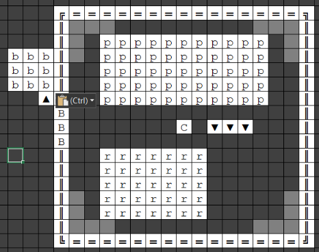

That, you may remember, is the surface entrance to your fortress
(remember, the light grey tiles are just a reminder about where plumbing
might be installed) , but with a few new features. First, designate
another blocks stockpile (denoted by “b” in the diagram), and remember
to give it the same settings as the previous blocks stockpile. In
addition, set this one to take from the one inside. Construction will
proceed much faster with a local stockpile (this strategy of using
helpfully-placed “feeder” stockpiles, which you should have read about
in the links above, is extremely versatile and effective, and you'll see
it a lot).

The other new features are made from these stone blocks, and should be
constructed as your mason makes them available. First, it's surrounded
by a wall (the double lines) . The B stands for “Bridge”, which I'll get
to in the next section, so leave it empty for now. But once the wall is
done, build the ramp just next to the opening where the bridge is going
to go. Finally, roof over the whole area - but there's no need to
construct floors directly over the walls themselves, only the open
spaces. You'll need somewhere north of 300 blocks for this entire
structure (I haven't done the precise arithmetic). Fortunately, one
piece of stone makes four blocks.

This fact is behind one of the arguments *against* using stone blocks:
you'll soon have an over-abundance of stone, so using the raw stone will
help de-clutter your fortress. The other argument is defence. If I'm
understanding [climbing](http://dwarffortresswiki.org/index.php/Climber "wikilink") correctly, it's impossible
to climb walls made from smoothed natural stone, but block walls *can*
be climbed. By all means, if you find these arguments persuasive, simply
use natural stone in your building projects, or perhaps at strategic
defensive points. Personally, in the early game I find the need for
materials is greater than the supply of stone - so making blocks
stretches it further - and the much lighter weight of stone blocks is
important due to the limited supply of hauling labour, so I'd still
recommend making all your constructions and workshops from stone blocks.
In addition, climbing invaders can be easily excluded by adding a slight
overhang, and anyway the roof makes this structure completely airtight.

Our entrance is nearly secure. Once we build the bridge, we can tell any
invader…

You Shall Not Pass
------------------

Building the [Bridge](http://dwarffortresswiki.org/index.php/Bridge "wikilink") itself is actually pretty easy.
Follow the menu options to make a bridge which is three tiles long (so
wagons can fit through), one tile wide, and raises to the east. Place it
in the gap and choose “iron bar” as the building material. You
architect/mason will come along and design the thing, but building it
requires the Metalsmith labour. I recommend temporarily activating this
for your mechanic/stonecrafter, then disabling it once the bridge is
done.

Bridges are operated by levers, so build one from a stone mechanism.
Where? Well, when danger threatens, you'll want plenty of dwarves nearby
so the lever gets pulled as quickly as possible (as the Titan strides
towards your fortress you *will* be screaming at them to hurry up) - so
place it in the map centre tile, in the middle of the spiral ramp, in
your middle fortress layer (the first layer you dug out, with all the
mason's workshops). There will still be a stockpile tile here, since
this is the room where we dumped everything from the wagon, so just
remove that single stockpile tile in order to build the lever there.
Now, you're eventually going to accumulate a fair few levers throughout
the fortress, and it's surprisingly easy to forget what they do. Place a
note on this lever tile saying something like “Main fortress entrance
bridge”.

We now need to connect the lever to the bridge, which requires two
mechanisms. A stone mechanism is fine for the lever side of the
connection, but not for the bridge side, because it'll melt under
dragonfire, rendering your bridge inoperable. We need to make an iron
mechanism from the other iron bar we brought along at embark. This
requires a few temporary labours, for which I'd recommend (again) your
mechanic/stonecrafter.

First, enable wood burning and metal crafting. Then, in any spare room
or rooms (doesn't matter where - these are temporary structures) build a
metalsmith's forge (which will require your anvil) and a wood furnace.
Make two units of charcoal in the wood furnace - you still should have a
couple of logs lying around from your wagon - then make two iron
mechanisms at the metalsmith's forge, which will consume the charcoal
and two of your iron bars. Deconstruct the two workshops and then turn
off wood burning and metal crafting on your mechanic/stonecrafter.

Finally, link the lever to the bridge, *making sure* that the iron
mechanism is selected for installation in the bridge, and a stone
mechanism is used for the lever! I know, I know, you made *two* iron
mechanisms, but that second one will be needed for something else…

Congratulations! Now when danger threatens, you can raise the bridge and
nothing (except ghosts) will be able to get into your fortress. There's
still a long way to go security-wise, but you're doing well so far.
