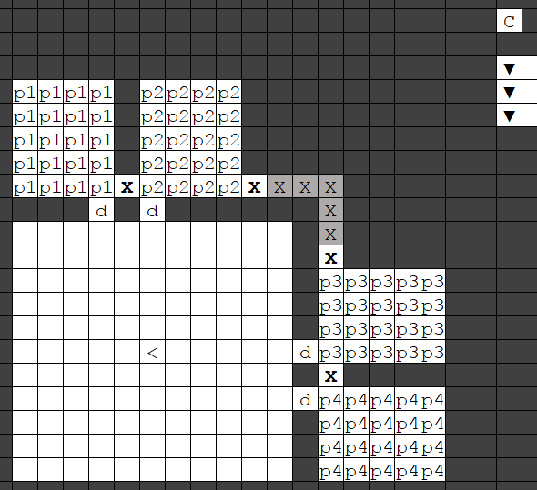
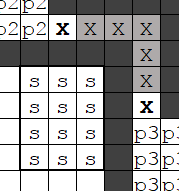
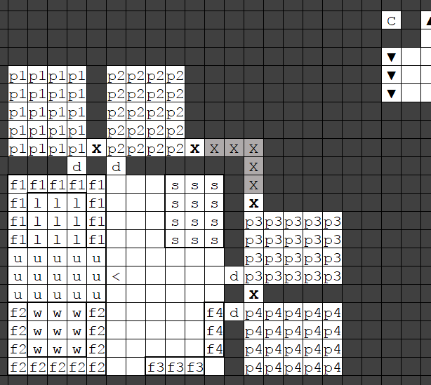

### Plants are complicated

Eggs were the easiest part of the food industry - plants are rather more
complex. One simple and important distinction is between the plants you
can grow indoors (the seeds you embarked with) and those your herbalist
will be gathering from outside, because we're going to treat the two
categories rather differently.

Raw plants can be processed in many ways - cooked, brewed, milled,
extracted and so on - and have different uses at each stage - not just
food and drink, but also trade and textiles. Our immediate needs, of
course, are food and drink, and we'll use that lens to cut through the
complexity for your early fort. The following arms of the food industry
are too fiddly and not urgent:

-   Milling, while eventually very important, requires a fair bit of
    labour and a supply of empty bags
-   Some seeds can be milled into a paste (e.g. rock nuts) and then
    (olives can skip straight to this next step) pressed to yield
    [Oil](http://dwarffortresswiki.org/index.php/Oil "wikilink"), which can be cooked or made into soap, and a
    dry [cake](http://dwarffortresswiki.org/index.php/Press_cake "wikilink"), which can be cooked. This
    requires milling, in addition to jugs and screw presses and
    associated labours, so we'll skip it for now.
-   Some plants can be processed into thread for the textile industry or
    slurry for the paper industry. That will crop up (heh) later in this
    guide.
-   [Valley herbs](http://dwarffortresswiki.org/index.php/Valley_herb "wikilink") can be processed into golden
    salve, which is a useless but high-value trade commodity, providing
    you have glass vials available. You don't, and that doesn't matter;
    cook them instead.
-   Quarry bushes can be processed to bag, yielding rock nuts and
    cookable quarry bush leaves. This requires bags, so we'll defer
    this - we'll simply plant our rock nuts and harvest the quarry
    bushes, which will accumulate in our stockpiles until we don't have
    any rock nuts left to plant or quarry bushes to harvest. No biggie.

That being the case, we are interested only in the following use cases,
which possibly overlap for each crop:

-   Direct eating of the raw plant, which (usually) produces seeds.
    Examples: plump helmets, apple
-   Brewing of the raw plant, which (usually) produces seeds. Examples:
    plump helmets, millet, pig tails
-   Cooking of the raw plant, which destroys seeds. Do this for all the
    outdoor (gathered) plants, but not for any of your indoor (farmed)
    crops, or you may run out of seeds!
-   Planting of the seeds - only for indoor plants
-   Cooking of the seeds - only for outdoor (gathered) plants!
-   Special case: sweet pods can produce a large amount of cooking
    ingredients by being processed into “dwarven syrup”. This is
    [buggy](http://dwarffortresswiki.org/index.php/Dwarven_syrup#Bugs "wikilink"), but we have a simple
    workaround which will also allow us to cook booze.

### Dirt farmer

There's a vast diversity of outdoor plants you might encounter, so for
starters we're going to focus on the six indoor, farmed plants. The
following table lists the plants, their growing season, and what we will
be using them for (for much more info, see the tables on the
[Crop](http://dwarffortresswiki.org/index.php/Crop "wikilink") page).

  Plant               | Growing season            | Early-fort uses
  ------------------- | ------------------------- | -----------------------------------------------------------
  **Dimple cups**     | All seasons               | Nothing: plant all seeds, wait for textile industry
  **Pig tails**       | Summer & autumn           | Brew dwarven ale
  **Cave wheat**      | Summer & autumn           | Brew into dwarven beer
  **Sweet pods**      | Spring & summer           | Brew into dwarven rum; process to barrel as dwarven syrup
  **Quarry bushes**   | Spring, summer & autumn   | Nothing; plant all seeds and wait for textile industry
  **Plump helmets**   | All seasons               | Brewing into dwarven wine (and occasionally eating raw)

Go to the z-menu and select “Kitchen” to make sure none of these crops
are allowed to be cooked, and all are permitted for brewing.

Time to start setting up your farming area. In the muddied medium rooms,
build four 4 x 5 plots (you may need to wait for the water to evaporate)
like so:

We're going to have a different seasonal rotation in each one.

  Plot     | Summer     | Autumn       | Winter          | Spring
  -------- | ---------- | ------------ | --------------- | -------------
  **P1**   | Pig tail   | Pig tail     | Dimple cups     | Sweet pod
  **P2**   | Pig tail   | Cave wheat   | Dimple cups     | Quarry bush
  **P3**   | Pig tail   | Pig tail     | Plump helmets   | Sweet pod
  **P4**   | Pig tail   | Cave wheat   | Plump helmets   | Quarry bush

You want extra pig tails for the textile and paper industries later on.
This growing pattern won't need much tinkering with as the fortress
expands - we'll just be able to use the plants in different ways.

In the inside corner of the large 11 x 11 room, designate a 3 x 4 food
stockpile and restrict it to just allow the seeds for these six plants.

Don't forget to turn off the special option “Prepared food” by pressing
from the stockpile's options, and also set the max barrel in this
stockpile to zero. Seeds are stored in bags, which can be stored in
barrels, but that's pretty unnecessary for these plants. The population
of seeds for a given species is capped at 200 per fortress, and you can
store 100 seeds in a single bag; that means, for the six underground
crops, you'll only ever need a maximum of twelve bags, hence the 3 x 4
stockpile size.

The rest of the large room on this level will be dedicated to processing
these underground crops. That means we'll need a stockpile for the
plants, a brewery, a farmer's workshop (for manufacturing dwarven syrup)
and a stockpile for barrels and large pots. We'll also leave some space
for future milling operations. The setup looks like this:

-   `w`: Farmer's workshop
-   `l`: Still
-   `u`: Furniture stockpile, set to only accept wooden and stone
    barrels and pots, and taking from the stone pot stockpile and the
    wooden barrel stockpile. This stockpile also gives to the farmer's
    workshop and the still.
-   `f1`: Food stockpile set to accept only the brewable underground
    crops (sweet pods, plump helmets, cave wheat and pig tails) and
    giving to the still. Remember to turn off prepared meals!
-   `f2`: Food stockpile, set to accept only sweet pods, with max barrel
    set to zero. This stockpile should be set to “take from links only”,
    and take from `f1`, and give to both the still and the farmer's
    workshop. This way, it serves as a kind of “sweet pod-ometer”; when
    sweet pods are low, this stockpile will not be full. This
    configuration also prevents sweet pods effectively being “reserved”
    for dwarven syrup when you need them for brewing. Remember to turn
    off prepared meals!
-   `f3`: Food stockpile set to only accept quarry bushes (turn off
    prepared meals).
-   `f4`: Food stockpile set to only accept dimple cups (prepared meals…
    off…)

I know I go on about remembering to turn off prepared meals, but
seriously. I always forget. That's your last warning.

Now, at minimum, your dwarves have something to eat (plump helmets) and
drink (brewery products). But it's important to have a balanced diet…