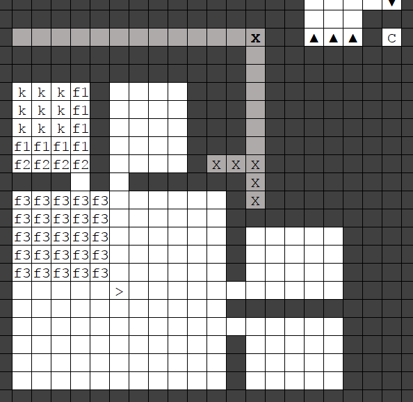

### The Foremost of Halls

Before you send your herbalist out traipsing the grassy fields,
gathering posies, we need somewhere to store all those plants. In
addition, some of them won't be edible, but will need cooking, so you'll
build a kitchen. Finally, your dwarves will want somewhere to sit and
eat comfortably, which means a dining hall.

Let's start with the dining hall. Pretty straightforward - use the large
11 x 11 room in the middle fortress layer, above the farms. Your mason
should have made four tables and chairs by now - arrange them, pairing
one table orthogonally adjacent to one chair, any way you wish. I like
the classic long-bench design, like so:

Ah. Reminds me of the great mead-hall Heorot, where generous Hrothgar
distributed rings and feasts to the sea-Geats.

Place a door at the entrance (get your mason to make one if you don't
have any spare) and we'll use one of the tables to designate it as a
[Dining room](http://dwarffortresswiki.org/index.php/Dining_room "wikilink"). Make sure the room fills the
whole 11 x 11 area. Set the “Meeting hall” option to “Yes”, so your
dwarves have somewhere to socialise, including your expedition leader
hosting the caravan diplomats.

Your dwarves will fetch a mid-season snack, take a seat, and chow down,
so let's place the meals nearby. Make a food stockpile (`f1`) in the
medium room before the corridor, and disallow everything except prepared
meals:

Unlike when enjoying a leisurely sit-down meal, parched dwarves tend to
be a bit more desperate. They'll simply fetch a mug, dunk it in the
nearest barrel of swill, and quaff where they stand. That's a shame,
because a dining hall can (and should) be one of the nicest rooms in the
fortress, which makes your dwarves happy - they won't be nearly as
cheered when skulling swill in whatever dingy broom closet serves as
your booze stockpile. The eminently sensible solution, of course, is to
place your booze and mugs) in the dining room.

Make a large food stockpile which covers the entire 11 x 11 dining room,
then cut away all but a 1-tile border, and set it only to allow drinks.
Then make a finished goods stockpile (allowing only mugs of stone, with
max bins set to zero, and set to take from the mug stockpile) which
covers the remaining 9 x 9 area. Then cut away the corner squares so
there's only a 1-tile wide plus-shape remaining, like so:

There. Now there's space for another three long benches, bringing the
hall's total capacity to 32. Since your dwarves don't all eat and drink
at once, that will be enough for a good while. Fill it with tables and
chairs whenever your mason has a spare moment. This will also be your
main booze stockpile for now, so monitor the levels frequently and try
to keep it topped up.

Our other requirement is a kitchen. Before we do that, however, we need
to set things up for your herbalist.

### Eat Your Greens

Raw food is all well and good, but [Cook\#Prepared
Meals](http://dwarffortresswiki.org/index.php/Cook#Prepared_Meal "wikilink") are better, though they require at
least one solid ingredient. Looking at the list of indoor crops, then, a
clear limitation emerges - excluding seeds (which we need for farming)
and processing plants to bags (including milling), plump helmets are the
only solid cookable indoor crop. However, we don't want to cook them at
this stage, because the seeds will be destroyed and we risk running out
of our only edible farm crop. Eggs will provide a fair supply of solid
ingredients, but at first we're preventing our dwarves from harvesting
them so we can grow our flock.

Our herbalist is here to save the day. On a nice embark, there should be
plenty of wild plants to gather (including fruit and nuts from trees)
which are either directly edible or cookable. Others can be brewed,
which produces seeds as a by-product; since we're not interested in
planting an above-ground farm just at this moment, we can also cook
these seeds. That should provide plenty of solid ingredients for
prepared meals.

Setting up food stockpiles gets very complicated once you need to deal
with all the outdoor plants. Again, we're going to follow the principle
of exclusion: turn off all plants, and then re-enable only the ones
present on your map. Unfortunately this is a little tedious. I'd
recommend designating plant-gathering over a large area surrounding your
fort (say, 66 x 66, at priority level 5 or 6) and then looing at every
plant thus highlighted. Examine every plant and consult the
[wiki](http://dwarffortresswiki.org/index.php/Crop "wikilink"). Anything which can be brewed, enable that in
the feeder stockpile for your still. Anything which cannot be brewed
should be cookable and/or edible raw - write these down. You'll need the
list soon. Then, examine all the trees on the map (or at least near the
fortress) and, again, look them up on the wiki. Anything which is
brewable, enable its products in the still feeder stockpile, and
anything which is not brewable but is cookable or edible raw, add it to
your list.

There's just one further consideration: a small bug which means liquid
ingredients are rarely used in cooking. This drastically reduces the
total amount of material available for prepared meals, so for this and
other reasons it's worth implementing the slightly awkward workaround.
This exploits the fact that, although cooks prefer solid ingredients,
they even more strongly prefer ingredients in barrels. The solution is
to create a no-barrel stockpile for your solid ingredients.

We'll use one of the medium rooms upstairs from the dining hall. In the
corner, make a kitchen and around the edges make a single-tile ring of
food stockpiles (`f1`) set to only accept dwarven syrup. In the
remaining four tiles of the room, make another food stockpile allowing
only booze (`f2`), and set to take from the main booze stockpile in the
dining hall (again, monitor levels to make sure you don't cook all your
booze). Next, in the large 11 x 11 room, in the corner nearest the
kitchen, make another 5 x 5 food stockpile (`f3`) accepting only a) eggs
b) everything on your list of outdoor plants which can be cooked and/or
eaten but not brewed, and c) all outdoor plant seeds and nuts (for once
it's easiest just to turn off the seeds for the indoor plants); and set
max barrel for this stockpile to zero. The final layout should look like
this:

Set all three stockpiles to give to the kitchen.

The final step is to create a feeder stockpile for solid, cookable food
items, which gives to the no-barrel stockpile. Make another 5 x 5 food
stockpile (`f4`) in another corner of the 11 x 11 room, set only to
accept the same items as the stockpile for cookable solid foods. Don't
change the default max barrel setting. Set this to give to the no-barrel
stockpile.

In this setup, brewing is prioritised, i.e. anything which can be brewed
is never cooked directly, although its alcohol product can be. There are
several reasons for this. First, dwarves drink more than they eat, so in
terms of sheer quantity you'll need more raw materials for brewing.
Second, you can cook with booze anyway, as long as you have at least one
solid ingredient, so booze can be easily converted into prepared meals
but it's not possible to go in the other direction. Thirdly, satisfying
booze preferences is straightforward so it's important to prioritise
keeping a good diversity of booze on-hand; on the other hand, making
dwarves happy with food is tricky. It seems that dwarves don't value the
quality of meals so much *unless* it happens to contain one of their
preferred ingredients; since (as far as I know) they simply grab the
nearest edible item, the odds of a meal happening to contain their
preferred food is quite low. That means there's not a very reliable
return on making sure that all possible ingredients are made available
for cooking.

Great! You should already have designated plant-gathering jobs over a
decent area of the surface near your entrance. In addition, add a large
fruit-picking zone nearby, and watch your herbalist get to work. Don't
trade away any stepladders which are in use, because the first thing you
hear about it will be your herbalist dying of thirst while stuck up a
tree. The final thing to do is go into the z-menu and, under “kitchen”,
make sure everything which can be brewed is permitted only for brewing,
none of the indoor crops or seeds are permitted for cooking, but
everything else (outdoor non-brewable plants and outdoor seeds) is
permitted for cooking. You'll need to update this as your herbalists
harvest additional plant varieties.

Before we wrap up, there's a few more things to say about the food
industry. First, experienced farmers and herbalists harvest larger
stacks of plants, which yields enormous efficiency returns as those
stacks are funnelled through the brewing and cooking chains. For this
reason, in the workshop orders it's advisable to set “only farmers
harvest” to maximise their skill gain. If you find crops are dying on
the vine, turn this off again. Second, prepared meals can become
ridiculously valuable as your cook levels up, and make a great trade
commodity if you have a surplus. There's no reason to leave raw
ingredients hanging around - as long as it's not going to run your booze
supply dangerously low, you may as well set “cook lavish meal” on repeat
(simple meals give your cook more experience but are less efficient to
haul). Thirdly, hungry dwarves will grab the nearest edible item - you
want this to be a prepared meal and not an apple. We put the stockpile
of prepared meals in the medium room of the corridor leading to the
dining hall, so they're in front of all the raw ingredients and will be
chosen by hungry dwarves no matter where they are in your fortress.
There's one exception, which is dwarves already inside the dining room,
which may have raw edible ingredients closer to hand. This isn't the end
of the world, but it's another good reason to keep cooking all your raw
ingredients to prepared meals as quickly as possible. Another simple
solution is, on the middle staircase tile simply to make a 1-tile food
stockpile which only accepts prepared meals and takes from the main
prepared meal stockpile. If a dwarf happens to be having a drink in the
dining room booze stockpile, and suddenly gets a hankering for some
grub, the nearest edible item will always be a prepared meal.
Unfortunately there's not a lot you can do for the brewer and cook when
they're working close to raw ingredients. Whenever you make a stockpile
for raw edibles elsewhere in the fort, remember to put a small stockpile
of prepared meals “in front”.
